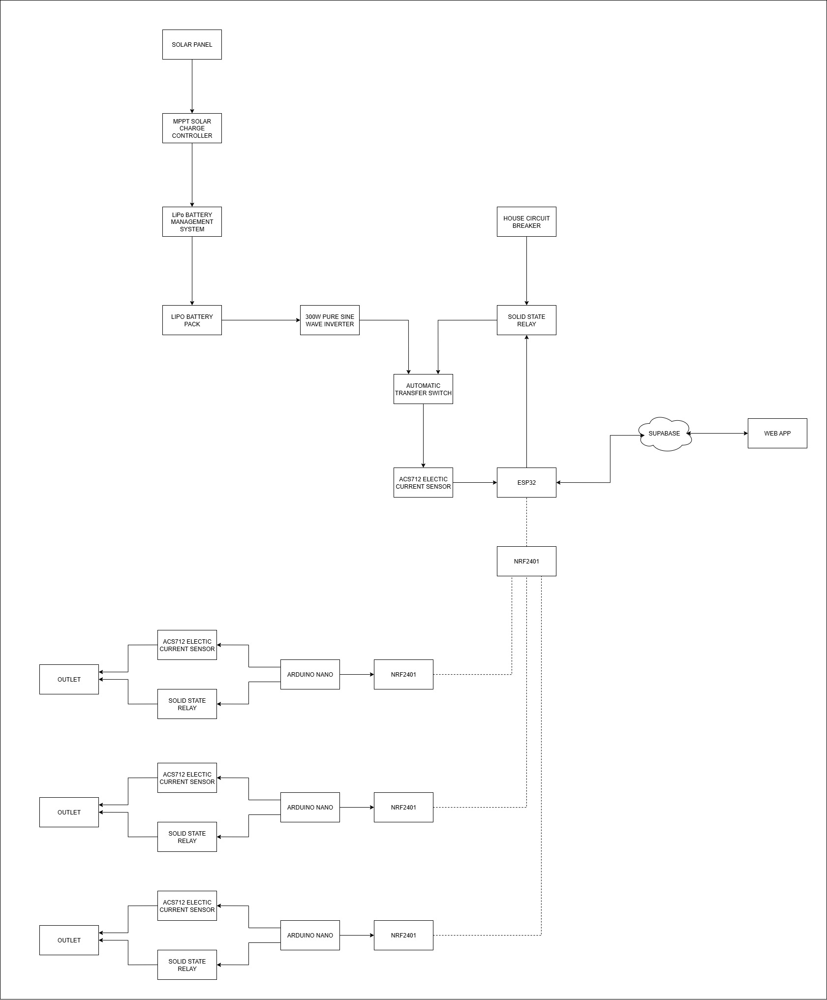

# SmartWatt

SmartWatt is a distributed smart energy limiter system designed to help households, boarding houses, and small businesses save on electricity costs. It uses a network of ESP32 microcontrollers and precision sensors to monitor and control multiple outlets, and automatically switches the main power source between grid, solar, or battery backup when a daily energy limit is reached.

## System Architecture

1. **Solar & Battery Subsystem**

   - **Solar Panel** → **MPPT Solar Charge Controller** → **LiPo Battery Management System** → **LiPo Battery Pack**
   - **Pure Sine Wave Inverter** (300W) converts battery DC to AC.
   - **Automatic Transfer Switch (ATS)** chooses between inverter output and grid power.
   - **Solid State Relay (SSR)** connects the selected source to the house circuit breaker.

2. **Master Controller (ESP32)**

   - Reads total system current via ACS712 sensor.
   - Communicates daily energy usage and user settings to Supabase.
   - Forwards control commands to distributed outlet controllers via ESP-NOW.

3. **Distributed Outlet Controllers** (one per outlet)

   - **ESP32** monitors outlet current with an ACS712 sensor.
   - Controls outlet power via a dedicated SSR.
   - Joins the ESP-NOW mesh network to report usage and receive limit flags from the master controller.

4. **Cloud & Web Dashboard**
   - **Supabase** stores user accounts, settings, and energy logs.
   - **Web App** (hosted static site) provides secure login, live consumption dashboard, manual override, and monthly savings reports.

## Features

- **Per-Outlet Monitoring & Control**  
  Track and limit energy consumption at individual outlets.

- **Automatic Source Switching**  
  When the total daily kWh limit is reached, ATS and SSRs safely switch to solar/battery backup.

- **Distributed ESP-NOW Network**  
  Low-latency communication between the master ESP32 and outlet controllers without Wi‑Fi.

- **Secure Cloud Storage**  
  User profiles, limits, and usage logs are managed via Supabase.

- **Web-Based Dashboard**
  - Secure login
  - Set or adjust daily kWh limit
  - Real-time system and per‑outlet consumption
  - Manual override of grid or solar/battery source
  - Monthly savings report

## Hardware Components

- Solar panel and MPPT charge controller
- LiPo battery pack with BMS
- 300W pure sine wave inverter
- Automatic Transfer Switch (ATS) module
- Solid State Relays (SSRs) for system and each outlet
- ACS712 current sensors (system and per outlet)
- ESP32 microcontrollers (master and distributed controllers)
- Standard house wiring and circuit breaker panel

## Software & Cloud

- **ESP32 Firmware**

  - Master node: system monitoring, Supabase sync, ESP-NOW master
  - Outlet nodes: per-outlet monitoring and SSR control

- **Supabase**

  - PostgreSQL database for users, settings, and logs
  - Auth for secure login
  - Storage (optional) for graphs or logs

- **Web App**
  - Static React (or framework of choice) application
  - Connects to Supabase via its JavaScript SDK

## Installation & Deployment

1. Flash ESP32 firmware to master and outlet controllers.
2. Assemble hardware following the block diagram.
3. Configure Supabase project:
   - Create tables: `users`, `settings`, `system_logs`, `outlet_logs`.
   - Set up Auth and policies.
4. Deploy web app to any static host (Netlify, Vercel, GitHub Pages).
5. Enter Supabase project URL and key in the web app configuration.

## Configuration

- **Daily kWh Limit**: Set in the Settings page of the dashboard.
- **Manual Override**: Select grid or solar/battery source from the live dashboard.
- **Outlet Enable/Disable**: Toggle individual outlets on the dashboard.

## Contributing

1. Fork the repository.
2. Create a branch (`git checkout -b feature/your-feature`).
3. Commit changes (`git commit -m "Add feature"`).
4. Push (`git push origin feature/your-feature`).
5. Open a Pull Request.

## License

This project is licensed under the [MIT License](LICENSE).
